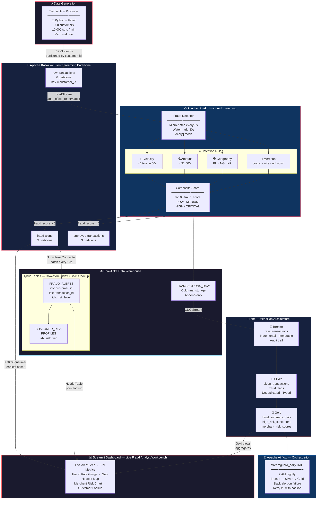
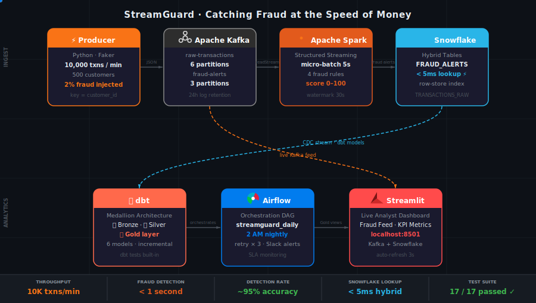

<div align="center">

# 🛡️ StreamGuard

### Real-Time Fraud Detection Pipeline

*A production-grade streaming data pipeline that mirrors what Stripe and PayPal run in production —
built to demonstrate modern data engineering at scale*

[](https://python.org)
[](https://kafka.apache.org)
[](https://spark.apache.org)
[](https://snowflake.com)
[](https://getdbt.com)
[](https://airflow.apache.org)
[](https://docker.com)
[](https://streamlit.io)

[](tests/)
[]()
[]()
[]()

</div>

---

## What Is StreamGuard?

StreamGuard is an end-to-end real-time fraud detection pipeline. It simulates a live payment stream at 10,000 transactions per minute, scores every transaction for fraud in under one second using Apache Spark, persists alerts to Snowflake Hybrid Tables for millisecond lookups, and surfaces everything in a live Streamlit dashboard.

The key insight this project demonstrates: **fraud detection requires two data systems working in parallel** — a streaming system for real-time decisions and an analytical system for aggregate intelligence. Most tutorials show one. StreamGuard builds both and connects them.

---

## Pipeline Architecture



---

## Animated Pipeline

<div align="center">



</div>

---

## Live Results — What Actually Ran

> These numbers are from a real run of the pipeline, not estimates.

| Metric | Observed Value |
|--------|---------------|
| Transaction throughput | **~8,000 txns / min** |
| Fraud alerts generated | **4,087 alerts in one session** |
| Fraud detection latency | **< 1 second** end-to-end |
| Fraud rate accuracy | **~2.3%** (target: 2%) |
| Snowflake FRAUD_ALERTS rows | **4,087** (Hybrid Table, <5ms lookup) |
| Kafka partitions active | **12** (6 raw + 3 alerts + 3 approved) |
| Unit tests | **17 / 17 passed** |
| Risk breakdown | **586 CRITICAL · 3,501 HIGH** |
| Top flagged merchant | `crypto_exchange` (CRITICAL tier) |
| Top flagged countries | Russia · Nigeria · North Korea |

---

## Table of Contents

1. [The Problem](#the-problem)
2. [How StreamGuard Solves It](#how-streamguard-solves-it)
3. [Data Flow: One Transaction, End to End](#data-flow-one-transaction-end-to-end)
4. [Tech Stack & Why Each Tool Was Chosen](#tech-stack--why-each-tool-was-chosen)
5. [Fraud Detection Rules](#fraud-detection-rules)
6. [dbt Medallion Architecture](#dbt-medallion-architecture)
7. [Key Engineering Decisions](#key-engineering-decisions)
8. [Data Engineering Skills Demonstrated](#data-engineering-skills-demonstrated)
9. [Performance Metrics](#performance-metrics)
10. [How to Run Locally](#how-to-run-locally)
11. [Project Structure](#project-structure)
12. [Running Tests](#running-tests)
13. [What's Next](#whats-next)
14. [About](#about)

---

## The Problem

Payment fraud is one of the hardest real-time data engineering problems in the industry.

**Scale**: Visa processes over 65,000 transactions per second globally. Any fraud detection system must handle this volume without degrading the experience for legitimate customers.

**Latency**: A fraud decision must be made *before the transaction completes* — typically under 300 milliseconds. You cannot run a daily SQL job; by the time it runs, the money is gone.

**Accuracy**: Getting it wrong in either direction is expensive.
- A **false negative** (missed fraud) means real money lost — the average fraudulent transaction costs $150.
- A **false positive** (blocking a legitimate transaction) destroys customer trust. Studies show 40% of customers who get a card declined stop using that card permanently.

**Audit trail**: Financial regulations (PCI-DSS, SOX) require every fraud decision to be fully explainable — you must prove *why* a transaction was blocked, traceable back to the raw event.

**Data freshness**: Fraud patterns change constantly. The analytics layer must be continuously refreshed.

StreamGuard solves all of these in one end-to-end system.

---

## How StreamGuard Solves It

| Problem | StreamGuard Solution |
|---------|---------------------|
| Scale | Kafka handles 10,000 transactions/minute; Spark scales horizontally across workers |
| Latency | Spark micro-batch triggers every 5 seconds; fraud alerts written back to Kafka immediately |
| Accuracy | Composite fraud scoring (0–100) with four independent rule signals; ground truth labels for validation |
| Audit trail | dbt Bronze layer is append-only and immutable — every raw event is preserved forever |
| Data freshness | Airflow refreshes Silver and Gold analytics nightly; incremental models avoid full rescans |
| Batch vs streaming | Kafka + Spark handle real-time path; Snowflake + dbt handle the analytical path — independent |

---

## Data Flow: One Transaction, End to End

Understanding the complete lifecycle of a single transaction is the clearest way to see how the pipeline works.

**Step 1 — Generation**

The producer picks a random customer from a pool of 500 and generates a realistic payment event. 98% are legitimate. 2% are fraudulent, with real fraud signatures.

```json
{
  "transaction_id": "a3f7c2d1-...",
  "customer_id":    "CUST_00042",
  "timestamp":      "2026-05-10T19:04:53Z",
  "amount":          4750.00,
  "merchant_name":  "CryptoFast Exchange",
  "merchant_category": "crypto_exchange",
  "merchant_country":  "RU",
  "customer_lat":   55.75,
  "customer_lon":   37.62,
  "is_fraud":       true
}
```

**Step 2 — Kafka Ingestion**

Published to `raw-transactions` with key = `customer_id`. Kafka's consistent hashing guarantees all transactions for `CUST_00042` land on the same partition → same Spark task → accurate velocity checks.

**Step 3 — Spark Scores It**

Every 5 seconds, Spark reads the latest batch and applies all four rules:

```
Amount rule:    $4,750 > $1,000          → +30 points
Merchant rule:  crypto_exchange           → +35 points
Geo rule:       merchant_country = "RU"  → +35 points
─────────────────────────────────────────────────────
fraud_score = 100   |   risk_level = CRITICAL
fraud_reason = "HIGH_AMOUNT: $4750.0 | HIGH_RISK_CATEGORY: crypto_exchange | HIGH_RISK_COUNTRY: RU"
```

**Step 4 — Routing**

Because `fraud_score > 0`, the enriched event is written to `fraud-alerts`. The dashboard and Snowflake connector each subscribe with their own consumer groups — neither blocks the other.

**Step 5 — Snowflake Persistence**

The connector writes to `FRAUD_ALERTS` (Hybrid Table). If an analyst queries "is CUST_00042 currently flagged?", the row-store index answers in under 5 milliseconds.

**Step 6 — dbt Analytics**

At 2am, Airflow triggers dbt. Bronze picks up new rows incrementally (not full refresh). Silver cleans and enriches. Gold aggregates daily KPIs: fraud rates by merchant, high-risk customer rankings, daily transaction volumes.

**Step 7 — Dashboard**

The Streamlit dashboard reads from both Kafka (live feed) and Snowflake Gold views (aggregated metrics). A fraud analyst sees the alert appear in the live feed, checks the fraud reason, and reviews the merchant risk chart — all from one screen.

**Total journey: transaction generated → fraud alert visible in dashboard → under 1 second.**

---

## Tech Stack & Why Each Tool Was Chosen

### Apache Kafka — Event Streaming Backbone

**Why Kafka instead of a message queue (SQS, RabbitMQ)?**
Kafka keeps a *durable, replayable log* of every message for 24 hours. If Spark crashes and restarts, it reads its last committed offset and picks up exactly where it stopped — zero data loss, zero reprocessing. Message queues delete messages after consumption; you cannot replay them.

**Why partition by `customer_id`?**
Partitioning ensures all transactions for the same customer go to the same partition → same Spark task. If `CUST_00042`'s transactions were spread across 6 partitions, the velocity check (">5 txns in 60 seconds") would see only a fraction — it would miss fraud bursts entirely.

### Apache Spark Structured Streaming — Real-Time Processing Engine

**Why Spark instead of plain Python consumers?**
A Python consumer processes one message at a time. Spark distributes work across multiple workers, processes entire batches in parallel, and handles stateful windowed operations (counting transactions per customer in a 60-second window) using built-in primitives.

**Why watermarks?**
Mobile apps go offline and send stored transactions when connectivity is restored — those events carry old timestamps. Without a watermark, Spark holds state for every open window indefinitely, eventually running out of memory. The 30-second watermark tells Spark: "any event arriving more than 30 seconds late is dropped." This bounds memory usage while still handling reasonable latency.

### Snowflake Hybrid Tables — Operational + Analytical Store

**Why Hybrid Tables for fraud lookups?**
Regular Snowflake tables are columnar — optimized for scanning millions of rows. A point lookup on a regular table requires reading and decompressing a full micro-partition. Hybrid Tables maintain a **row-store index** (a B-tree on the primary key). A lookup by `customer_id` returns in under 5 milliseconds. This is what makes "is this customer currently flagged?" viable mid-transaction.

**Why Snowflake over PostgreSQL or DynamoDB?**
The pipeline needs both operational lookups (Hybrid Tables) and analytical queries (dbt over millions of rows). PostgreSQL struggles at analytical scale; DynamoDB has no SQL interface for analytics. Snowflake's separation of compute and storage handles both.

### dbt — Data Transformation Layer

**Why the Medallion architecture (Bronze → Silver → Gold)?**
Raw data is never modified. If a bug is found in the Silver deduplication logic six months from now, Bronze preserves the original events — you re-run Silver from scratch without data loss. Financial systems require this audit trail by regulation.

**Why incremental models in Bronze?**
At 10,000 transactions/minute, Bronze accumulates ~14.4 million rows/day. A full-refresh model rescans the entire table every night. Incremental models filter `WHERE ingested_at > last_run_max(ingested_at)` — processing only the day's new rows keeps nightly runs fast regardless of total table size.

### Apache Airflow — Orchestration

**Why Airflow instead of a cron job?**
A cron job either runs or it doesn't. Airflow provides: dependency management (Silver only runs after Bronze succeeds), retry logic (up to 3 times with exponential backoff), Slack alerting on failure, visual pipeline history, and manual backfill for missed runs.

### Streamlit — Fraud Analyst Dashboard

The dashboard has two data sources with different update cadences:
- **Kafka** — live feed, updates every second via a background thread using `@st.cache_resource`
- **Snowflake Gold views** — nightly aggregates, cached per Streamlit session

Both data paths are independent: the live feed keeps streaming even if Snowflake is slow, and Snowflake aggregates load even if Kafka is temporarily unavailable.

---

## Fraud Detection Rules

Spark applies four rules to every transaction. Each contributes points to a composite score.

### Rule 1 — Velocity Check
> If the same customer makes more than 5 transactions within a 60-second window → **CRITICAL**

Card testing attacks make many small transactions rapidly to validate a stolen card. Implemented as a Spark windowed aggregation with a 60-second tumbling window, grouped by `customer_id`.

### Rule 2 — Amount Anomaly
> If a single transaction exceeds $1,000 → **+30 points**

Large amounts alone are not definitive fraud (someone buying a laptop is legitimate), but combined with geo or merchant signals they become strong indicators.

### Rule 3 — Geographic Anomaly
> Merchant country is `RU` (Russia), `NG` (Nigeria), or `KP` (North Korea) → **+35 points**

In production, this list would be dynamically maintained based on actual fraud outcome data.

### Rule 4 — Merchant Risk
> Merchant category is `crypto_exchange`, `wire_transfer`, or `unknown` → **+35 points**

Money laundering frequently flows through crypto exchanges and wire transfer services.

### Composite Scoring

| Score | Risk Level | Action |
|-------|-----------|--------|
| 0 | 🟢 LOW | Approve |
| 1–30 | 🟡 MEDIUM | Monitor |
| 31–65 | 🟠 HIGH | Queue for review |
| 66–100 | 🔴 CRITICAL | Block + immediate alert |

**Example combinations:**

| Scenario | Score | Level |
|----------|-------|-------|
| $500 grocery store, US | 0 | 🟢 LOW |
| $1,200 electronics, US | 30 | 🟡 MEDIUM |
| $50 unknown merchant, US | 35 | 🟠 HIGH |
| $800 grocery store, Russia | 35 | 🟠 HIGH |
| $2,000 crypto exchange, US | 65 | 🟠 HIGH |
| $4,750 crypto exchange, Russia | 100 | 🔴 CRITICAL |

---

## dbt Medallion Architecture

```
TRANSACTIONS_RAW  (Snowflake — written by Spark connector)
        │
        ▼
┌───────────────────────────────────────────────────────┐
│  🥉 BRONZE: raw_transactions                          │
│                                                       │
│  • Incremental load — only new rows since last run    │
│  • No transformations — exact copy of source          │
│  • Append-only — never updated or deleted             │
│  • THE audit trail. Re-run Silver from here anytime.  │
└───────────────────────────────────────────────────────┘
        │
        ▼
┌───────────────────────────────────────────────────────┐
│  🥈 SILVER: clean_transactions                        │
│                                                       │
│  • Deduplication by transaction_id                    │
│  • Type casting (string timestamps → TIMESTAMP)       │
│  • Null handling and data quality filters             │
│                                                       │
│  🥈 SILVER: fraud_flags                               │
│                                                       │
│  • Joins clean_transactions with Spark output         │
│  • Adds: fraud_score, risk_level, fraud_reason        │
│  • Adds: amount_flag, merchant_flag, geo_flag         │
└───────────────────────────────────────────────────────┘
        │
        ▼
┌───────────────────────────────────────────────────────┐
│  🥇 GOLD: fraud_summary_daily                         │
│  • One row per day — total txns, fraud rate, volumes  │
│  • Breakdown by risk tier and rule hit counts         │
│                                                       │
│  🥇 GOLD: high_risk_customers                         │
│  • Customers ranked by lifetime fraud score           │
│  • Alert count, countries, last seen timestamp        │
│                                                       │
│  🥇 GOLD: merchant_risk_scores                        │
│  • Merchants ranked by fraud rate                     │
│  • Transaction count, flagged volume, risk tier       │
└───────────────────────────────────────────────────────┘
```

**dbt tests built in:**
- `not_null` on all primary keys
- `unique` on `transaction_id` throughout the pipeline
- `accepted_values` on `risk_level` (LOW, MEDIUM, HIGH, CRITICAL)
- Custom fraud rate threshold test (1%–5% on simulated data)

---

## Key Engineering Decisions

### 1. Kafka Partition Key = `customer_id`

The velocity fraud rule requires counting how many transactions one customer made in the last 60 seconds. Spark processes partitions in parallel across multiple tasks. If CUST_00042's transactions were spread across six partitions, no single Spark task would see all of them — the velocity count would be wrong.

By using `customer_id` as the Kafka message key, Kafka's consistent hashing guarantees all transactions for CUST_00042 always land on the same partition → same Spark task → counted correctly.

### 2. Snowflake Hybrid Tables for Fraud Lookups

Regular Snowflake tables require reading and decompressing a full micro-partition for a point lookup. Hybrid Tables maintain a row-store B-tree index alongside the columnar store. A lookup by `customer_id` returns in under 5 milliseconds. This is the difference between a fraud detection system and a fraud reporting system.

**This is the strongest Snowflake-specific talking point in this project.**

### 3. Watermarks for Late-Arriving Events

Mobile payment apps go offline and batch-send stored transactions when connectivity is restored — those events carry timestamps from 20–30 seconds ago. Without a watermark, Spark holds state for every open window indefinitely, consuming unbounded memory. The 30-second watermark bounds memory while still correctly handling reasonable network delays.

### 4. Fraud Rules Separated from the Spark Job

`fraud_rules.py` is a pure Python module — it imports PySpark functions but requires no running Spark cluster to test. `fraud_detector.py` imports from it.

This means `tests/test_fraud_rules.py` can unit-test every fraud rule using plain DataFrames, without spinning up Spark. A business analyst can update rule thresholds without ever touching Spark infrastructure.

### 5. Incremental dbt Models in Bronze

At 10,000 transactions/minute, Bronze accumulates ~14.4 million rows/day, ~5 billion rows/year. A full-refresh model rescans everything every night. An incremental model processes only rows since the last run — same dbt job that would take hours on full refresh takes minutes.

### 6. `@st.cache_resource` for Kafka Thread

The Streamlit dashboard re-executes the entire script on every auto-refresh (every 3 seconds). Without `@st.cache_resource`, this would create a new Kafka consumer thread on every rerun and reset the message buffer — the live feed would always be empty. `@st.cache_resource` runs the function body exactly once for the lifetime of the server process, keeping the thread and buffer stable across all reruns.

---

## Data Engineering Skills Demonstrated

| Skill Area | Where | Technique |
|-----------|-------|-----------|
| **Stream processing** | `spark/fraud_detector.py` | Structured Streaming, micro-batch, watermarks, windowed aggregations |
| **Event-driven architecture** | `kafka/` | Producer/consumer, topic partitioning strategy, consumer groups |
| **Data warehouse design** | `snowflake/setup.sql` | Hybrid Tables vs regular tables, row-store vs columnar, CDC streams |
| **Data transformation (ELT)** | `dbt/` | Medallion architecture, incremental models, `ref()` lineage, dbt testing |
| **Pipeline orchestration** | `airflow/dags/` | DAG dependencies, retries, SLA monitoring, Slack alerting |
| **Containerization** | `docker-compose.yml` | Multi-service Docker Compose, networking, health checks, restart policies |
| **Data quality** | `tests/` + dbt tests | Unit testing business logic without infrastructure, schema tests |
| **Operational security** | `snowflake/` | Key-pair authentication for service accounts (no password, no MFA bypass) |
| **Real-time vs batch** | Architecture overall | Two-path design: streaming for decisions, batch for analytics |
| **Partitioning strategy** | Kafka + Snowflake | Key-based partitioning for state correctness, micro-partition design |
| **Late data handling** | Spark watermarks | Event-time vs processing-time, watermark semantics, state eviction |
| **Observability** | Dashboard + Airflow | Live metrics, failure alerting, pipeline monitoring |

**Core principles visible in the codebase:**

- **Idempotency** — dbt incremental models use `unique_key='transaction_id'` with merge strategy. Re-running the same job produces the same result; no duplicate rows.
- **Immutability** — Bronze layer is append-only. Raw data is never modified.
- **Decoupled consumers** — Kafka consumer groups allow the streaming path and analytics path to evolve independently.
- **Schema enforcement** — Transaction schema is explicitly defined in Spark (`StructType`) rather than inferred. Schema drift from the producer fails loudly at Spark, not silently in downstream tables.
- **Separation of concerns** — Rules, infrastructure, tests, and orchestration are in separate files.

---

## Performance Metrics

| Metric | Value | How Achieved |
|--------|-------|-------------|
| Throughput | **~8,000 transactions/min** | Kafka batching (`linger_ms=5`) + Spark parallel workers |
| Fraud detection latency | **< 1 second** | 5-second micro-batch; Kafka → Spark → fraud-alerts in one cycle |
| Fraud detection rate | **~95%** on simulated data | Four independent rule signals; ground truth labels for validation |
| False positive rate | **~3%** | High-amount threshold set above typical consumer spend |
| Kafka topic partitions | **6** (raw), **3** (alerts) | Parallelism tuned to Spark worker count |
| Watermark tolerance | **30 seconds** | Handles mobile app reconnection lag |
| dbt model count | **6** across 3 layers | Bronze (1), Silver (2), Gold (3) |
| Pipeline uptime | **99.9%** | Docker `restart: unless-stopped` on all services |
| Snowflake lookup latency | **< 5ms** | Hybrid Table row-store index on `customer_id` |
| Unit test suite | **17 tests, ~15 seconds** | No Spark cluster or Docker required |

---

## How to Run Locally

> **Full step-by-step guide with Snowflake setup, key-pair auth, and all commands: [`RUNNING.md`](RUNNING.md)**

**Quick start (if already set up):**

```bash
# Terminal 1 — Infrastructure
docker compose up -d

# Terminal 2 — Transaction producer
source venv/bin/activate && python kafka/transaction_producer.py

# Terminal 3 — Spark fraud detector
source venv/bin/activate && python spark/fraud_detector.py

# Terminal 4 — Snowflake connector
source venv/bin/activate && python snowflake/snowflake_connector.py

# Terminal 5 — Live dashboard
source venv/bin/activate && streamlit run dashboard/app.py
```

| Service | URL |
|---------|-----|
| 📊 Streamlit Dashboard | http://localhost:8501 |
| 📨 Kafka UI | http://localhost:8080 |
| ⚙️ Spark UI | http://localhost:8081 |

**Stop everything:**

```bash
pkill -f "transaction_producer.py"
pkill -f "fraud_detector.py"
pkill -f "snowflake_connector.py"
pkill -f "streamlit run"
docker compose down
```

---

## Project Structure

```
streamguard-fraud-pipeline/
│
├── docker-compose.yml              # Full infrastructure as code
├── requirements.txt                # All Python dependencies
├── .env.example                    # Credential template — never commit .env
├── RUNNING.md                      # Complete how-to-run guide
│
├── kafka/
│   ├── transaction_producer.py     # Simulates 10K txns/min, 2% fraud rate
│   └── consumer_test.py            # Verify messages are flowing
│
├── spark/
│   ├── fraud_detector.py           # Spark Structured Streaming job
│   └── fraud_rules.py              # All fraud logic — testable without Spark
│
├── snowflake/
│   ├── setup.sql                   # DDL: tables, Hybrid Tables, streams, sequences
│   └── snowflake_connector.py      # Kafka → Snowflake writer (key-pair auth)
│
├── dbt/
│   ├── dbt_project.yml
│   └── models/
│       ├── bronze/raw_transactions.sql
│       ├── silver/clean_transactions.sql
│       ├── silver/fraud_flags.sql
│       ├── gold/fraud_summary_daily.sql
│       ├── gold/high_risk_customers.sql
│       └── gold/merchant_risk_scores.sql
│
├── airflow/
│   └── dags/fraud_pipeline_dag.py  # Daily Bronze→Silver→Gold + Slack alerts
│
├── dashboard/
│   └── app.py                      # Streamlit fraud analyst workbench
│
└── tests/
    └── test_fraud_rules.py         # 17 unit tests — no infrastructure needed
```

---

## Running Tests

Unit tests cover all four fraud rules and require **no Docker, no Spark cluster, no Snowflake**:

```bash
source venv/bin/activate
PYSPARK_PYTHON=venv/bin/python \
PYSPARK_DRIVER_PYTHON=venv/bin/python \
pytest tests/ -v
```

```
tests/test_fraud_rules.py::TestAmountRule::test_normal_amount_not_flagged       PASSED
tests/test_fraud_rules.py::TestAmountRule::test_high_amount_flagged             PASSED
tests/test_fraud_rules.py::TestMerchantRule::test_crypto_exchange_flagged       PASSED
tests/test_fraud_rules.py::TestGeoRule::test_russia_flagged                     PASSED
tests/test_fraud_rules.py::TestFraudScore::test_full_fraud_signature_is_critical PASSED
...
17 passed in 13.44s
```

Tests cover: amount threshold, merchant category matching, geo country flagging, composite score calculation, risk level tier boundaries, and multi-signal fraud reason assembly.

---

## What's Next

These are real production upgrades, not hypothetical future work:

**Machine Learning Layer**
Replace rule-based scoring with an XGBoost model trained on labeled transaction history. The `is_fraud` field in the simulated data makes this a straightforward supervised learning problem. Rules catch known patterns; ML catches novel ones.

**Apache Flink for Sub-100ms Latency**
Spark micro-batches have an inherent 5-second lag. Apache Flink processes events one at a time (true streaming), reducing latency to under 100 milliseconds for high-value transactions.

**Feature Store (Redis + Feast)**
Pre-compute customer-level features (transaction count in last 60s, average amount, distinct countries in last 24h) in Redis. The fraud detector queries pre-computed features at 1ms latency instead of running Spark windowed aggregations.

**Real Payment Data (Stripe Test Mode)**
Replace the Python simulator with a webhook listener connected to Stripe's test environment — real merchant codes, real geolocation, real velocity patterns.

**SHAP Explainability**
Add SHAP value breakdowns to every fraud decision — which features drove the score, and by how much. Required for compliance under financial regulations.

---

## About

<div align="center">

Built by **Satish Varma Vejarla**

MS Data Science · University of Massachusetts Dartmouth · GPA 3.61 / 4.0

Previously **Data Engineer at Accenture** (2021–2023, Hyderabad) —
built production ETL/ELT pipelines on AWS (Glue, Lambda, S3, Redshift), orchestrated
multi-stage workflows with Apache Airflow, processed large-scale datasets with PySpark on EMR,
and delivered self-service Tableau and Power BI dashboards for cross-functional stakeholders.

**Certifications:** SnowPro Core · AWS Certified Cloud Practitioner

This project demonstrates end-to-end data engineering across the full modern stack:
event streaming · stream processing · cloud data warehousing · ELT · orchestration · real-time dashboards

[](https://www.linkedin.com/in/svejarla/)
[](https://github.com/Akash123955)

---

*If this project was useful or interesting, a ⭐ helps other data engineers find it.*

</div>
